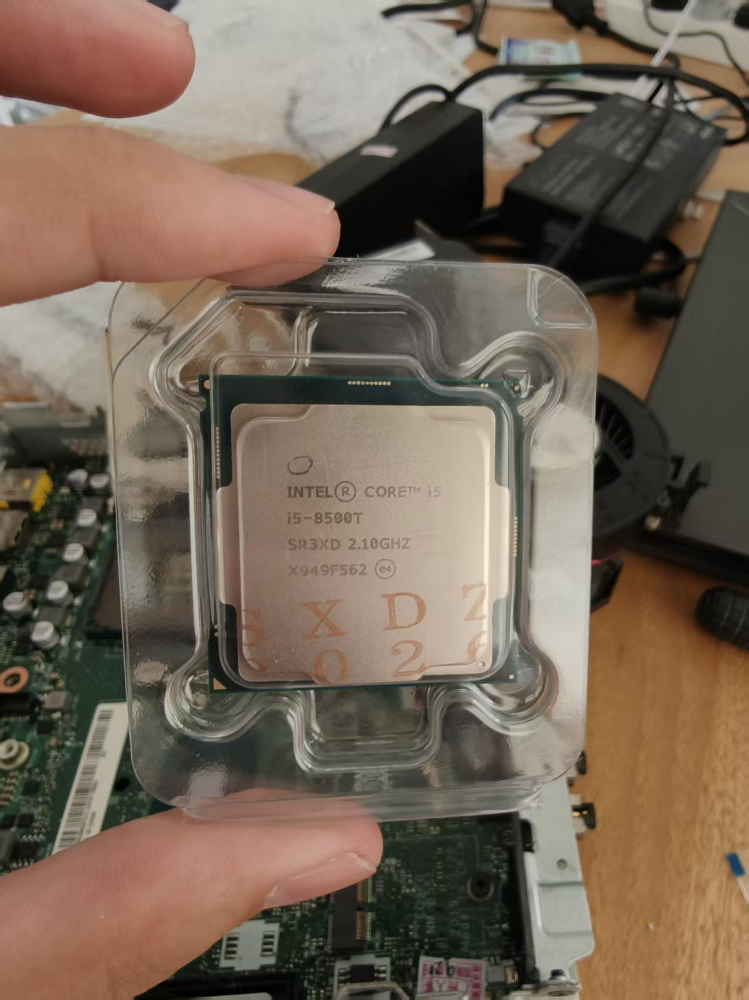
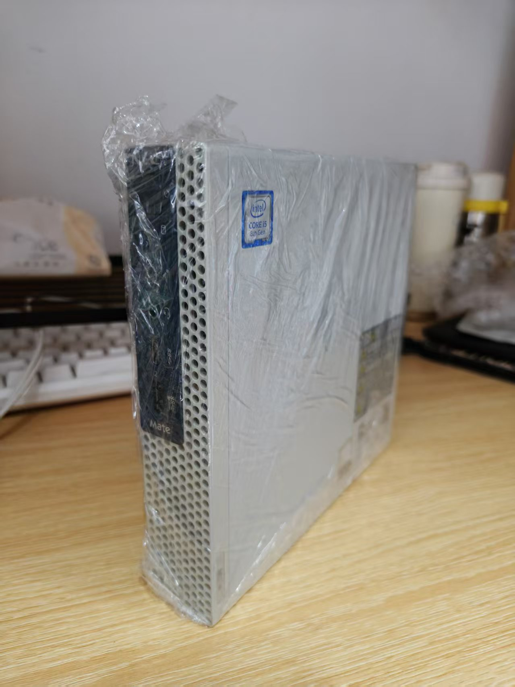
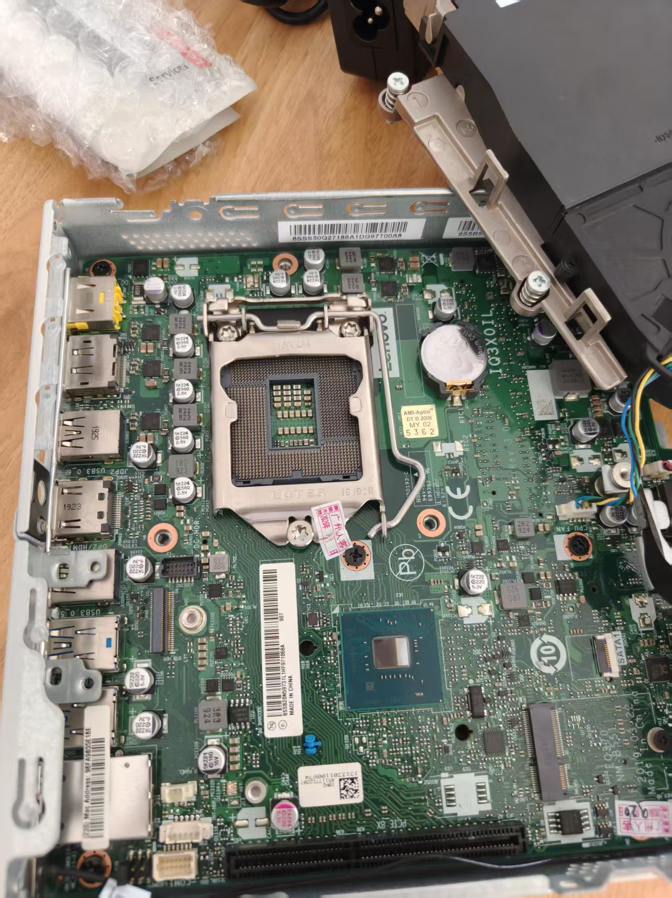
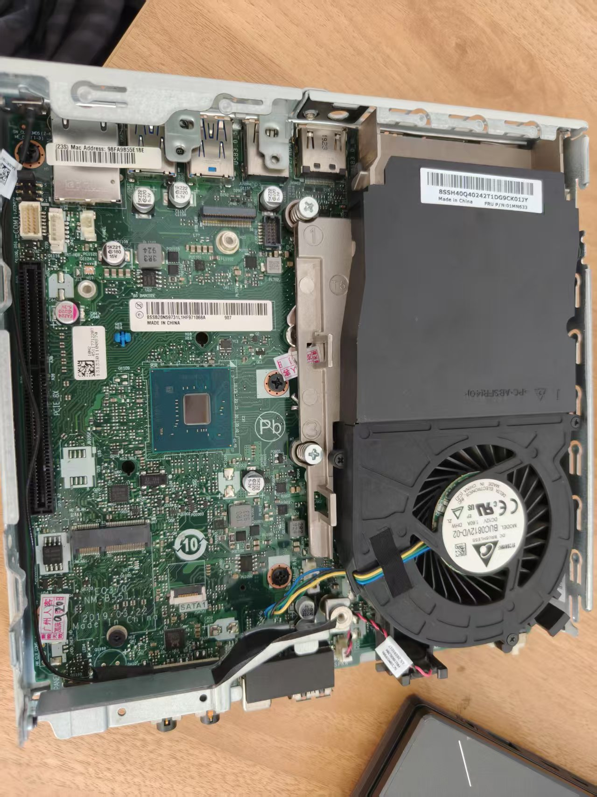
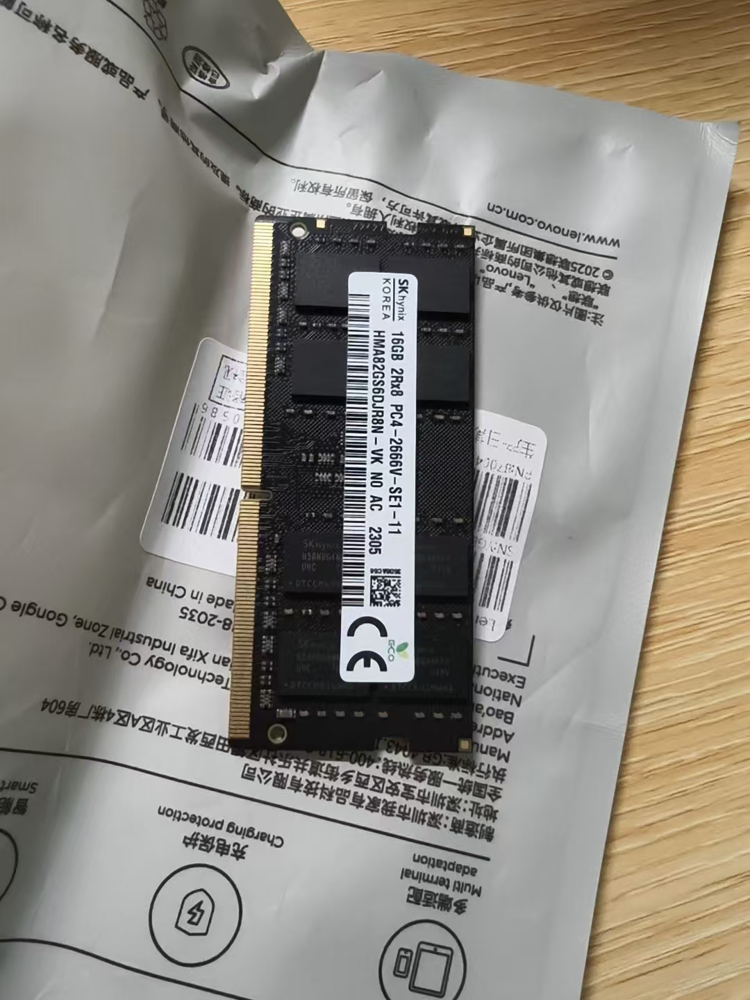
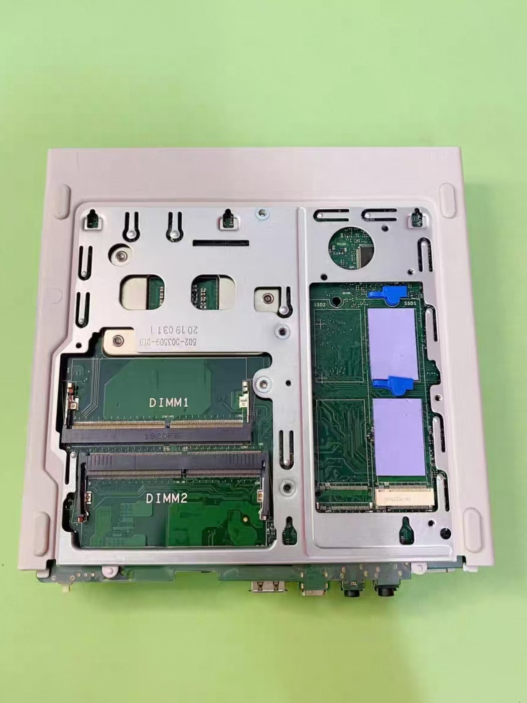
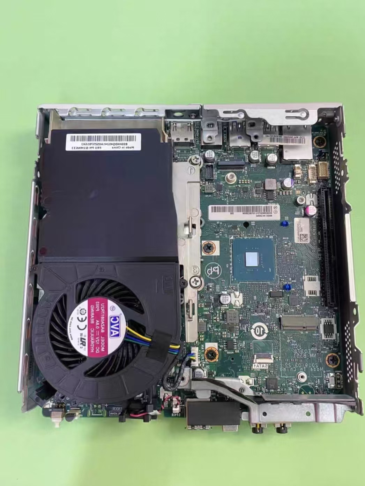
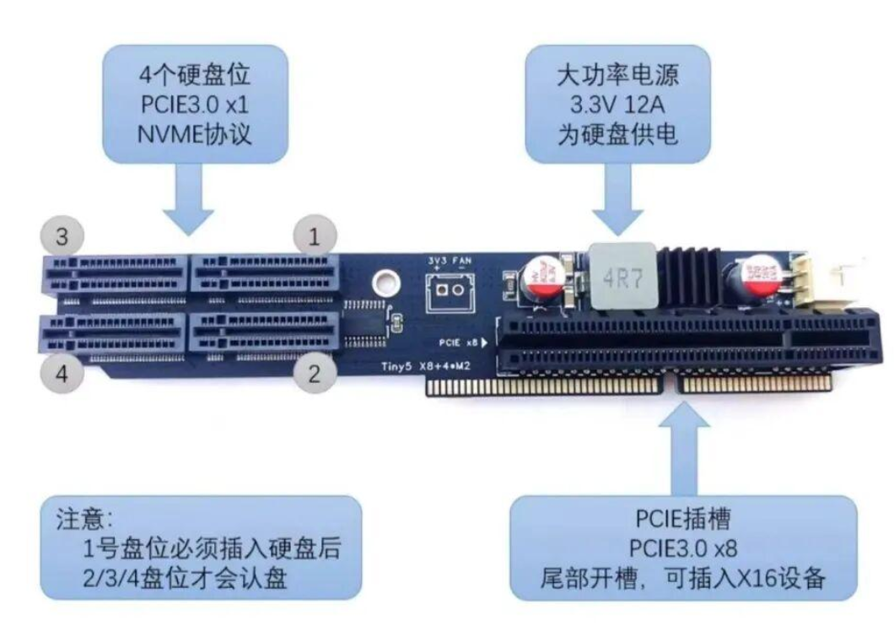

最近迷上了玩硬件，想搭一个自己的迷你主机，做云开发。其实早在一年前就有这样的想法了，只是在最近，变得特别强烈。于是就开始在海鲜市场淘垃圾了，经过几天的调研下来，最终选中的这款主机是 NEC 8 代 / 联想 M720q。

## 为什么选择 M720q

这两款主机基本是一模一样的，只不过 NEC 8 代是日版，也是联想代工完成，差别主要在于外壳：NEC 8 代是白色，联想 M720q 是黑色。

一开始我的想法是 M710q 之类的，CPU 打算选择 4 核 4 线程，预算控制在 500 元内。但后来发现，众所周知，由于内存和固态硬盘近几年的溢价，使得这个预算几乎不可能实现。后面了解到，M720q 主机跟 M710q 的价格差不多，同时 M720q 支持第 8～9 代 CPU，并且里面还有一个 PCIe 插槽。

经过一系列资料搜索，我发现大家对这个 PCIe 插槽的开发简直五花八门、无所不用其极：软路由、NAS、万兆网卡，甚至还有各种硬盘扩展方案，瞬间让我产生了极大的兴趣。一开始我的需求只是做云开发，后来发现 M720q / NEC 8 的 PCIe 扩展能力很适合做软路由，也就同时把这个需求纳入了考量之中。最终希望一台机器同时承担开发、软路由和家庭服务器。

> 让一台小主机同时承担开发主机、软路由和家庭服务器的角色。

## 初步系统规划

底层打算先安装 [Proxmox Virtual Environment（PVE）](https://www.proxmox.com/en/products/proxmox-virtual-environment/overview)。PVE 是一个基于 Debian 的开源服务器虚拟化平台，可以通过网页面板统一管理虚拟机、容器、存储和网络。简单来说，它可以先作为这台机器的“底座”，然后在上面安装和管理不同的系统。

这样做的好处是，后续想增加 OpenWrt、NAS 或其他实验环境时，不需要反复重装整台机器，也方便把不同用途的服务隔离开来，更适合做小型 All-in-One 家庭服务器。

目前的系统规划是：

- 在 PVE 上安装 Ubuntu Desktop，作为主力开发环境；
- 在 PVE 上运行 OpenWrt，承担软路由相关功能；
- 后续根据硬件扩展情况，再增加 NAS 或其他服务。

其实一开始是打算装 Debian 纯命令行开发的，后面想了想，装桌面版做主力机好了。装了 PVE 后续方便拓展系统，可以慢慢尝试小的 All-in-One 方案。

## 购买清单

| 配件 | 选择 | 价格 |
| --- | --- | ---: |
| 无线网卡 | Intel 9560AC + 内置天线 | 14 元 |
| CPU | Intel Core i5-8500T | 244 元 |
| VGA 扩展接口 | 适配 M720q 的扩展接口 | 20 元 |
| 主机准系统 | NEC 8 代 / 联想 M720q | 235 元 |
| 电源 | 随主机向卖家加购 | 35 元 |
| 内存 | 海力士 DDR4 16 GB 2666 MHz SO-DIMM | 400 元 |
| 固态硬盘 | 暂未购买 | 待补充 |

内存条理论上使用任意笔记本内存即可，但这条海力士 DDR4 16G 2666MHz SO-DIMM 花了 400 元，心在滴血……固态硬盘则暂时买不起了，后面降价了再补吧。

## 到货实物

以下是一些到货实物图，成色都挺不错的。这里将 1～5 号图片按两列排版：

  
  
  
  
  

## 机器结构与扩展能力

NEC 8 是联想 M720q 的日本版本，原生支持第 8～9 代 CPU。主机背部默认有一个 NVMe 硬盘位，另外还预留了一个 M.2 SATA 盘位，不过这个盘位是虚焊的；机内有两个内存槽，正面带一个 SATA 盘位和一个 PCIe 扩展插槽。

原机如果想焊接好 M.2 SATA 盘位，需要私下找人加钱焊。也就是说，这台机器虽然体积不大，但存储和 PCIe 扩展能力并不弱，真正的限制更多来自配件价格、改造成本和散热空间。

两张结构图如下：

  
  

## PCIe 扩展方案

目前几个主流方案：

- PCIe x8 插槽可以拓展万兆网卡；
- 通过魔改 BIOS 里的拆分选项，把原生的 PCIe 插槽拓展出 4 个 PCIe 3.0 x1 的盘位出来，同时额外增加一个 PCIe 3.0 x8；
- 使用拆分卡扩展多块硬盘，适合后续把它改造成 NAS 或家庭服务器。

听说拆分卡比较贵，我也没有具体了解，后续如果有需求的话再说。现阶段还是先把它作为开发主机运行起来，再根据实际需求决定是否增加万兆网卡、硬盘扩展卡或其他设备。

## 后续计划

这台机器目前还没有补齐固态硬盘，接下来希望早日买到合适的硬盘和内存，补完主机最后的形态 T...T

下一步会先把基础硬件补齐，再安装 PVE，逐步验证 Ubuntu Desktop、OpenWrt 以及其他服务的运行方式。

希望早日买到合适的硬盘和内存，把这台小主机补完，看看它最终能否稳定承担开发、软路由和家庭服务器这几个角色。

## 参考资料

- [NEC 8 代 / 联想 M720q 相关资料](https://zhuanlan.zhihu.com/p/1977187843265828012)
